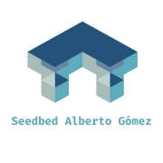
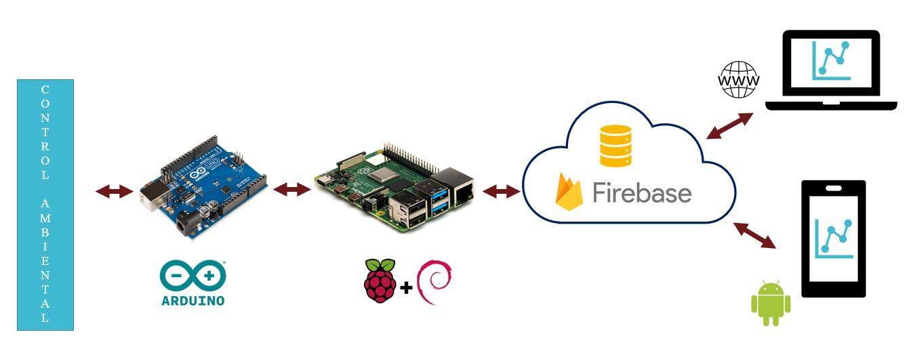
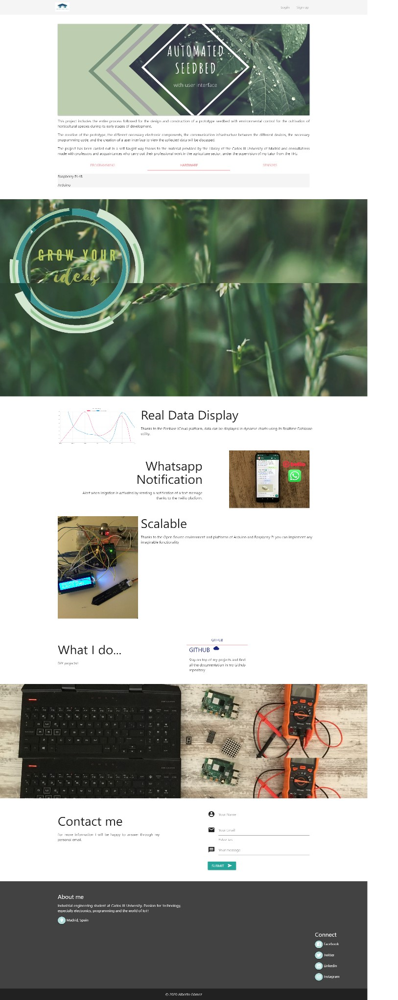
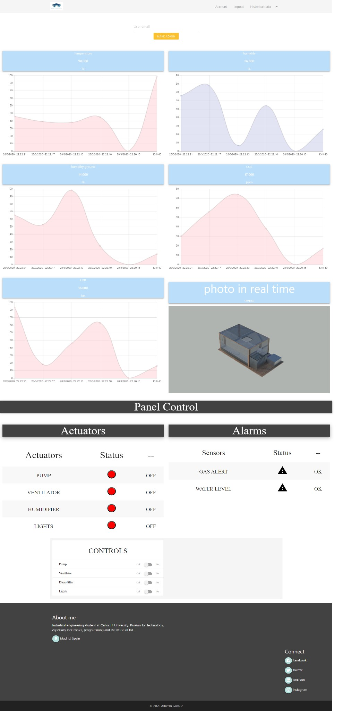
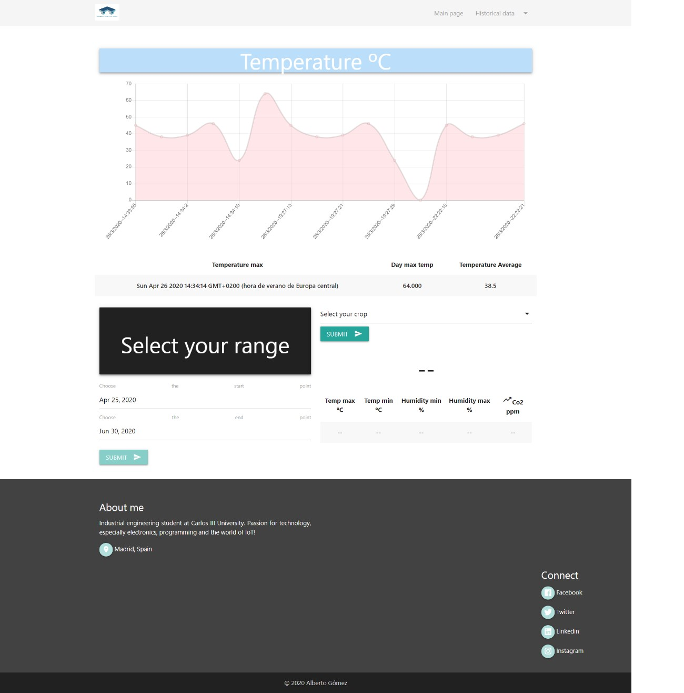

## Table of Contents


- [Description](#description)
- [Website App](#website)
- [Instalation](#instalation)
- [About me](#about)
- [Support](#support)
- [License](#license)


---

[](https://travis-ci.org/badges/badgerbadgerbadger)  [](http://badges.mit-license.org) 
## Description
<p align="center">
 
</p>

This project includes the entire process followed for the design and construction of a prototype seedbed with environmental control for the cultivation of horticultural species during its early stages of development.

The creation of the prototype, the different necessary electronic components, the communication infrastructure between the different devices, the necessary programming code, and the creation of a user interface to view the collected data will be discussed.

The project has been carried out in a self-taught way thanks to the material provided by the Library of the Carlos III University of Madrid and consultations made with professors and acquaintances who carry out their professional work in the agriculture sector, under the supervision of my tutor from the TFG.

<p align="center">
 
</p>

 * [See The complete bachelor thesis:](-------) - Bachelor Thesis uploaded in format PDF.
 
 * [Electrical design:](https://github.com/albertito1998/SeedbedwebsiteApp/blob/master/photos/sinPTC.png) - Electrical connections.

## Programming
 * [C++](https://isocpp.org/) - Programming language.
 * [Java](https://www.java.com/es/download/) - Programming language.
 * [JavaScript](https://www.javascript.com/) - Programming language.
  * [Node.Js - Express](https://nodejs.org/es/) - JavaScript runtime built on Chrome's V8 JavaScript engine.
 * [Materialize - HTML5](https://materializecss.com/) - A modern responsive front-end framework based on Material Design
 * [Firebase](https://firebase.google.com/?hl=es-419) - Google Cloud Platform

## Microprocessors
 * [Raspberry Pi](https://www.raspberrypi.org/) - Open Source Platform
* [Arduino](https://www.arduino.cc/) - Open Source Platform


## Sensors
- MQ-135
- LDR
- DHT22
- Capacity moisture sensor v2.0

**Real Data Display**
Thanks to the Firebase ICloud platform, data can be displayed in dynamic charts using its Realtime Database utility.

**Notifications**
Alert when irrigation is activated by sending a notification of a text message thanks to the Twilio platform and Cloud Messaging of Firebase.

**Scalable**
Thanks to the Open Source environment and platforms of Arduino and Raspberry Pi you can implement any imaginable functionality

## Website
<p align="center">
 
</p>
<p align="center">
 
</p>
<p align="center">

</p>

[Go to the website!! ](https://semillero-35a36.web.app/)


## Instalation

- *Clone* this repo to your local machine using `https://github.com/albertito1998/SeedbedAndroidApp`

Go to the folder ` ... SeedbedwebsiteApp/firebase-process/` and execute the following comands in cmd:
```comands
// code away!
// Install node npm and pm2
curl -sL https://deb.nodesource.com/setup_10.x | sudo bash -npm 
install node
install npm
install -g pm2

// install the dependencies in the package.json file

npm install -g
npm update -g
```
Compile and upload the code in Arduino with the file `Arduino.ino`

Start running the process in the Raspberry Pi:

```comands
// code away!
node  ... SeedbedwebsiteApp/firebase-process // The corresponding path in your computer
// or in the background
pm2 start ... SeedbedwebsiteApp/firebase-process // The corresponding path in your computer
```

## About 

<p align="center">
 
</p>
Industrial engineering student at Carlos III University. Passion for technology, especially electronics, programming and the world of IoT!. See my CV in the following link: [CV ](https://github.com/albertito1998/SeedbedwebsiteApp/blob/master/photos/Alberto%20G%C3%B3mez%20Zueco.pdf)

## Support

Reach out to me at one of the following places!

- Linkedin at <a href="https://www.linkedin.com/in/alberto-gomez-zueco-995538179/" target="_blank">`Linkedin`</a>
- Instagram at <a href="https://www.instagram.com/alber_gz/" target="_blank">`Instagram`</a>

---

## License

[](http://badges.mit-license.org)

- **[MIT license](http://opensource.org/licenses/mit-license.php)**
- Copyright 2020 © <a href="/LICENSE" target="_blank">MIT LICENSE ALBERTO GÓMEZ</a>.
